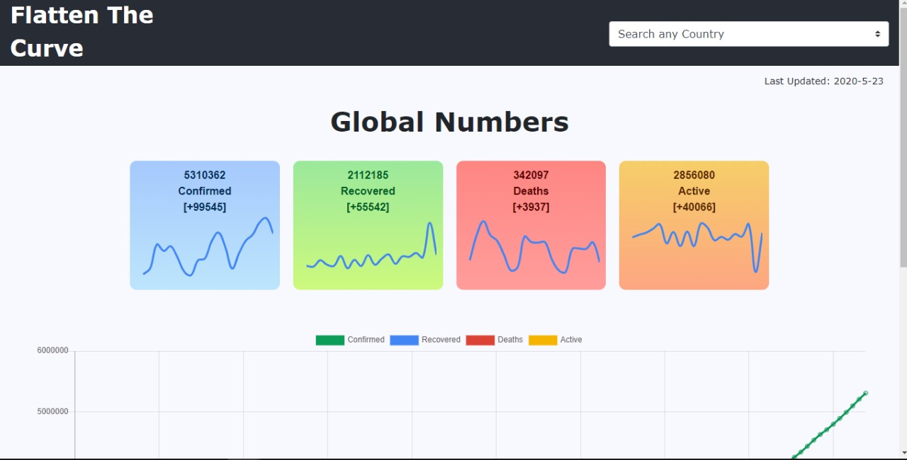
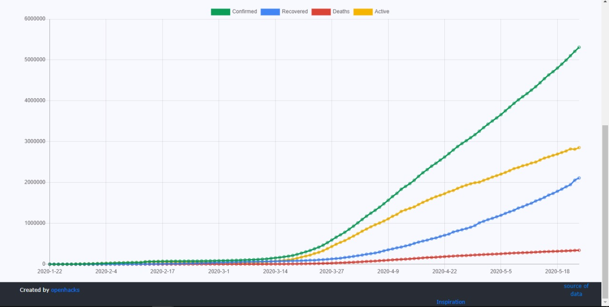
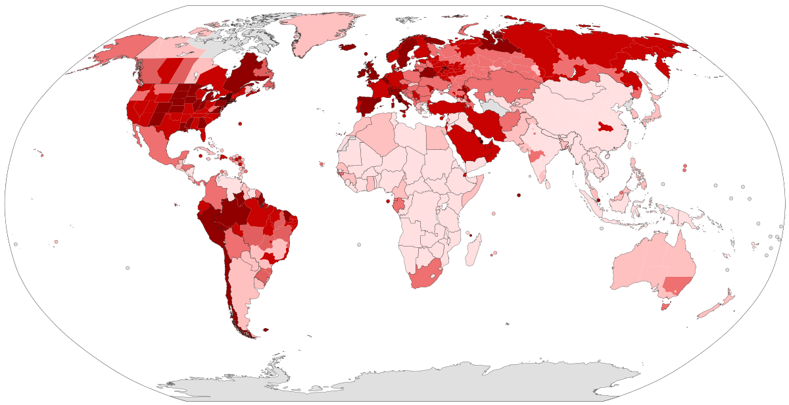

This App is our project submitted to Open_hacks Hackathon.

## Dependencies :
<ul> 
	<li> Node </li>
	<li> firebase </li>
</ul>

## Team Mates:
<ul> 
	<li> Chandan Prakash </li>
	<li> Solomon Staby </li>
</ul>

## API used :
References :[Api link](https://pomber.github.io/covid19/timeseries.json)

## Additional References:
[App](https://github.com/pomber/covid19)

[Here](
https://github.com/workaholic7/covid19visuals)

